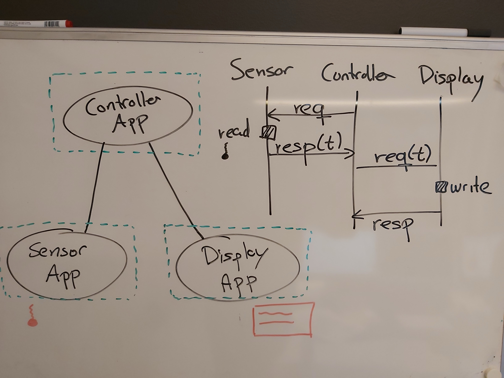
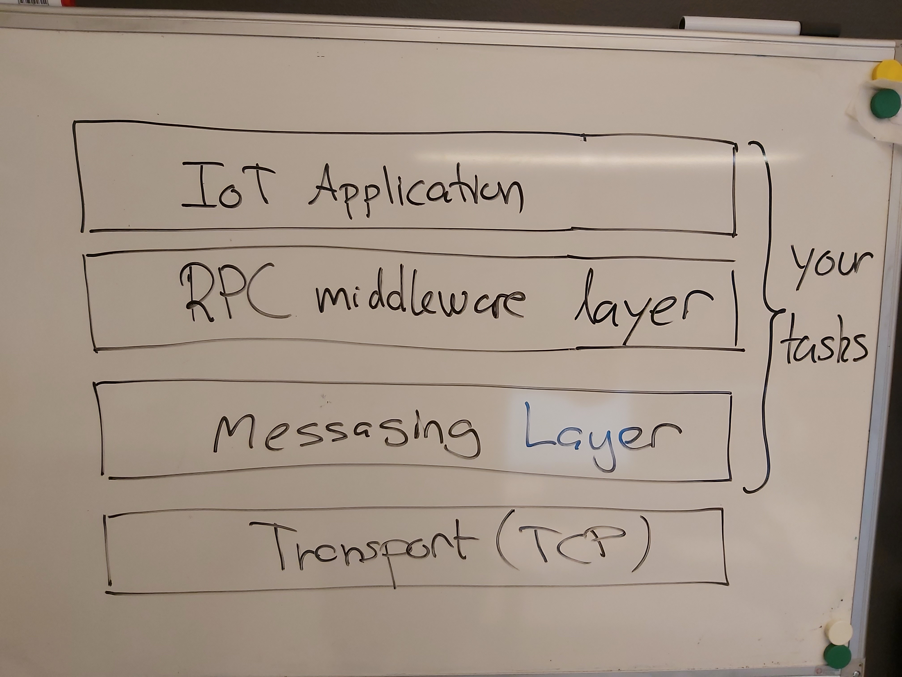
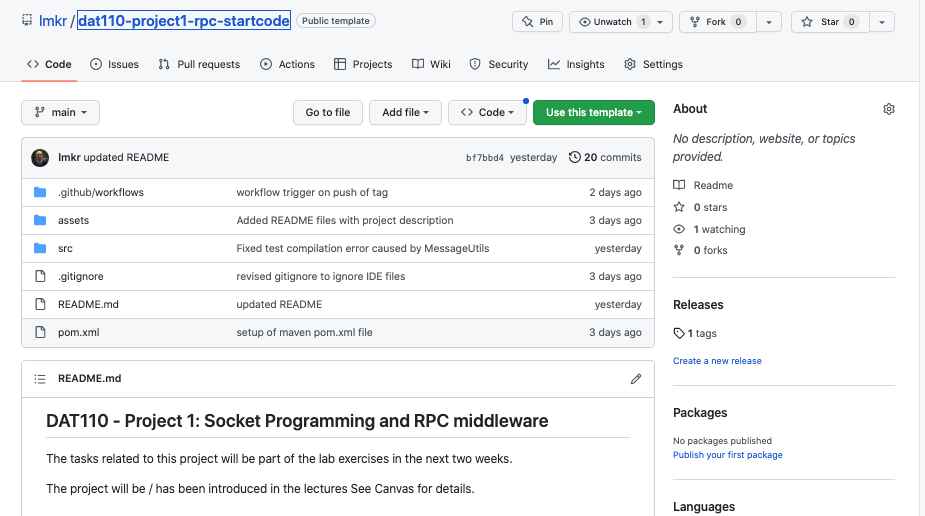
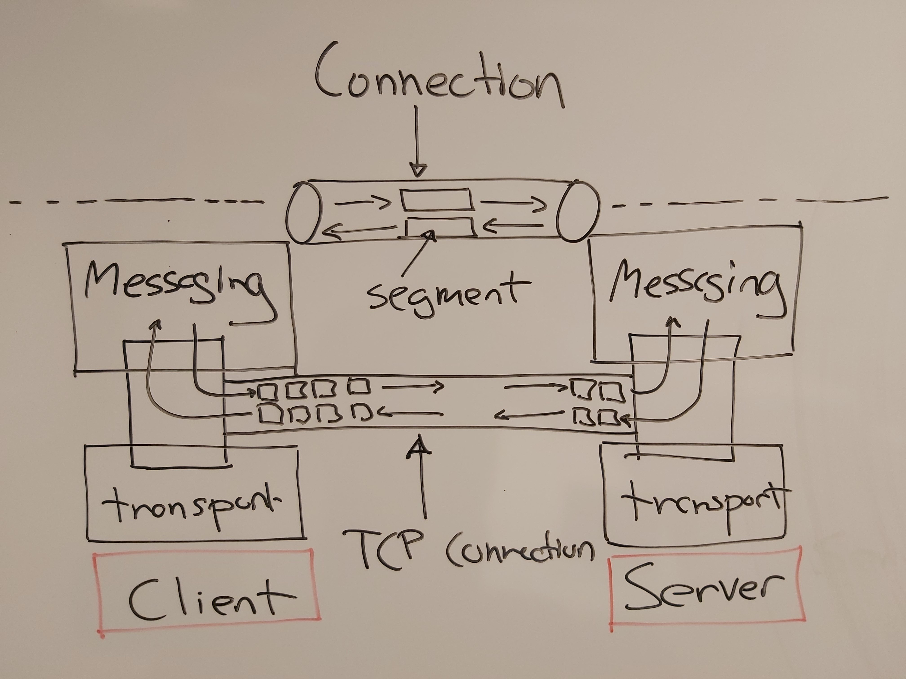
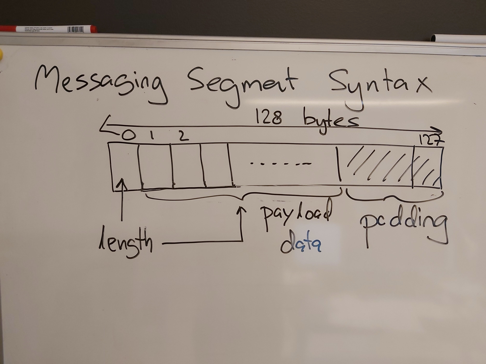
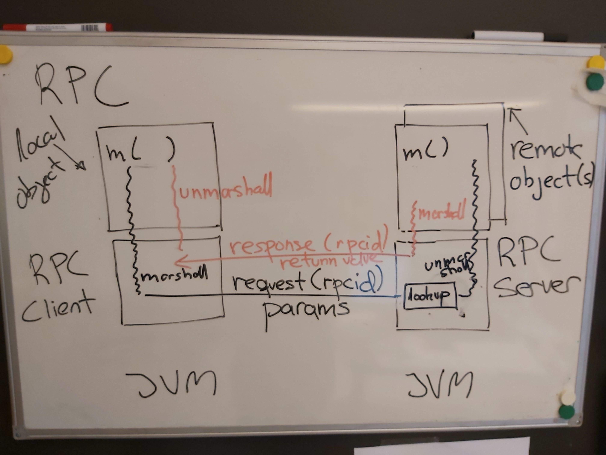
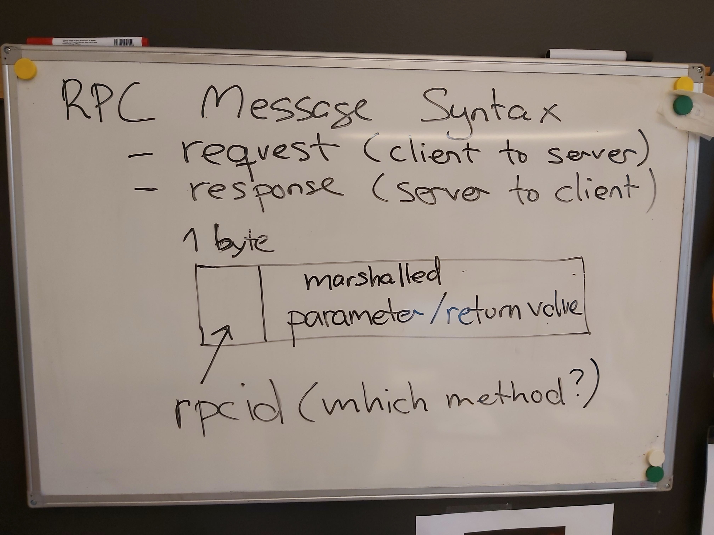
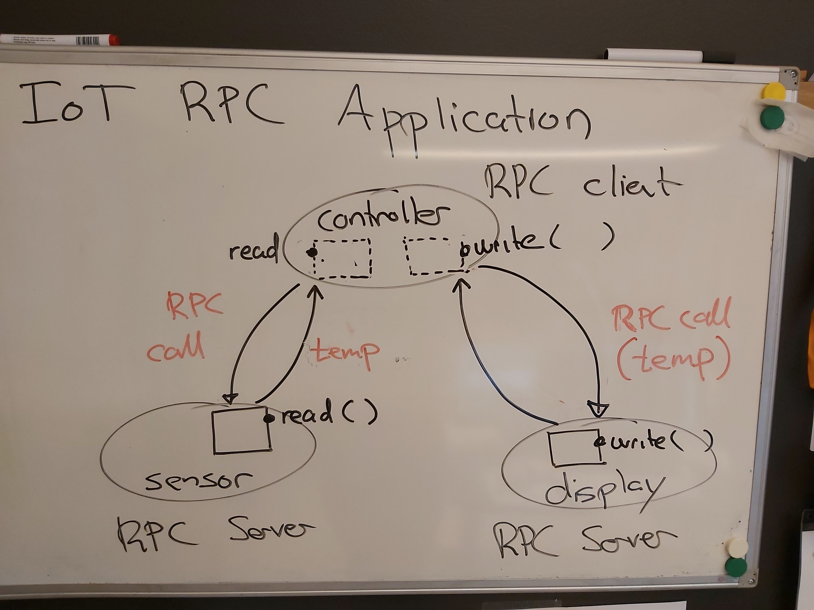
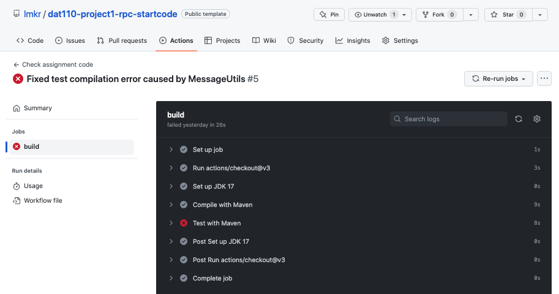

## DAT110 - Project 1: Socket Programming and RPC middleware

The tasks related to this project will be part of the lab exercises in the next two weeks.

The project will be / has been introduced in the lectures See Canvas for details.

### Organisation

The project is to be undertaken in **groups of 2-4 students**.

The labs can be used to obtain help with the project. You are strongly encouraged to also use the DAT110 Discord server throughout the project if you encounter issues or have questions related to the project. 

The deadline for handing in the project can be found in Canvas.

### Overview

The project builds on socket programming and network applications, and aims to consolidate important concepts covered in the course until now: layering, services, protocols, headers, encapsulation/decapsulation, remote procedure calls (RPC), and marshalling/unmarshalling.

The end-goal of the project is to implement a small IoT system consisting of a temperature sensor application, a controller application, and a display application. The controller is to request the current temperature from the temperature sensor (using RPC) and then request the display to show the temperature (using RPC).

The overall system and the communication between the components are illustrated below.



At the very base, the communication between the three applications is to be based on the TCP transport service using sockets. For programming convenience, we want to implement the application using a distributed systems middleware abstraction called remote procedure calls (RPC).

One **key advantage** of RPC as an abstraction mechanism is that we can program the networked application using what seems to be ordinary (local) method calls even if the body of the method is in fact executed on a remote machine. With the RPC middleware in place, the main loop of the controller can be implemented as follows:

```java
for (int i = 0; i<N;i++) {

  int temp = sensor.read();
  display.write(Integer.toString(temp));

  [...]
}
```
where the actual reading of the temperature and writing on the display takes place in a different application via the RPC middleware.

To break up the complexity of providing the RPC middleware, we will implement a layered client-server software architecture comprised of the three layers illustrated below.



This in turn means that the project is comprised of three main tasks

1. Implementation of a messaging layer on top of TCP sockets for exchanging short messages between a messaging client and a messaging server
2. Implementation of a light-weight RPC layer and distributed systems middleware on top of the messaging layer
3. Application of the RPC layer for realising a small IoT network application comprised of a sensor, and display, and a controller

### Getting started - obtaining the startcode and unit-test projects

The start-code and code containing unit tests is available via this git repository.

#### Use the start code repository as template 

One member of the group should start by entering the following repository on github:

https://github.com/lmkr/dat110-project1-rpc-startcode

and then do a *Use this template* of the repository (see button in the upper right of the repository web page as shown in the figure below).



This will create a "copy" of the start-code repository on that group members own github repository account. **Name** the copy of the repository as `dat110-project1-rpc-groupX` where `X` is your group number. 

In order for the other group members to work together on the (template) copy of the start-code, the other group members must be provided with access to read/write on  repository. See *Settings* and *Manage Access* for the repository that was forked.

### Clone the copy of the start-code repository 

The group members must *clone* the repository of the group member which can now be used as a repository for collaborating on the code.

The repository contains the start code organised into a [Maven](https://maven.apache.org/) project and can be imported into IDEs such as Eclipse and IntelliJ.

- Importing into Eclipse: Use `File -> Import -> Maven -> Existing Maven Projects` to import the startcode project
- Importing into IntelliJ: Use `File -> Open` to import the startcode project

The `src/main` folder contains the source code while the `src/test` folder contains a number of unit tests that can be used for some basic testing of the implemented functionality. These tests are by no means complete, and when running the test you should also check in the Eclipse console that no exceptions are raised when running the tests.

It should not be necessary to add additional classes in the start-code in order to complete the project. The unit-tests should not be modified as they will be used for evaluation of the submitted solution.

The code and tests can be compiled and run from the IDE or using maven commands with targets such as:

```
%>mvn compile
%>mvn test
```

It is also possible to execute the individual test classes by specifying the specific test-class to be executed. Below is an example of how to execute the tests in the `TestMessage`-class.

```
%> mvn test -Dtest=TestMessage 
```
### Task 1: Messaging layer

The messaging layer is to be implemented using sockets on top of the TCP transport service and provide a service for connection-oriented, reliable, and bidirectional exchange of (short) messages carrying up to 127 bytes of data/payload. 

The messaging layer is to be based on a client-server architecture supporting a (messaging) client in establishing a connection to a (messaing) server on top of which the messages can be exchanged.

This is illustrated in the figure below which shows the messaging layer connection for exchange of messages on top of the TCP connection supporting a bidirectional bytestream. The boxes between the transport and messaging layers represents TCP sockets.



The messaging protocol is based on sending fixed-sized *segments* of 128 bytes on the underlying TCP connection. The basic idea is that the first byte of the segment (header) is to be interpreted as an integer in the range 0..127 specifying how many of the subsequent 127 bytes is payload data. Any remaining bytes is simply considered padding and can be ignored.

The figure below shows the syntax of the message format to be used in the messaging layer



The implementation of the messaging service is to be located in the `no.hvl.dat110.messaging` package.

You are required to implement the methods marked with `TODO` in the following classes

- [ ] `Message.java` implementing the constructor, including a check that the data is not null and not longer than 127 bytes

- [ ] `MessageUtils.java` implementing methods for encapsulation and decapsulation of data according to the segment format described above.

- [ ] `Connection.java` implementing the connection abstraction linking the connection to the underlying TCP socket and associated input and output data streams that is to be used for sending and receiving messages.

- [ ] `MessagingClient.java` implementing the methods for the client-side of the messaging service and responsible for creating the underlying TCP socket on the client-side.

- [ ] `MessagingServer.java` implementing the methods for the server-side of the messaging service. In the current project, a server is only required to handle a single connection from a client.

Unit-tests for the messaging layer can be found in the `no.hvl.dat110.messaging.tests` package.

**Optional challenge:** If you have time, you may consider implementing a messaging protocol that supports the exchange of arbitrarily long messages and without the use of padding.

### Task 2: RPC layer

In this task you will implement a light-weight RPC middleware on top of the messaging layer from task 1. The RPC layer is also based on a client-server architecture in which the client-side is able to perform remote procedure calls on objects located on the server-side.

The basic idea of RPC is that a process can execute method (procedure) calls over the network on remote objects residing inside other processes. This is illustrated in the figure below in which a client invokes a method on a local-object (also called a stub/proxy) while the actual execution of the method body takes place in the remote object located on another machine and implementing the actual functionality of the method.



The RPC client middleware marshalles the parameters of the method into a request message which is then sent to the RPC server middleware. The RPC server middleware inspects the received request and executes the method being called. As the last step, the server marshalls the return value and sends it back to the RPC client middleware which can then return the result of the remote method call.  A detailed description of remote procedure calls can be found in **Chap. 4.2** of the distributed systems book.

The RPC middleware is light-weight in that only the types `void`, `String`, `int`, and `boolean` is supported as parameter and return types, and the methods supported can have at most one parameter. Furthermore, the middleware does not support automatic generation of stub-code and the marshalling and unmarshalling of parameters and return values. The (un)marshalling will have to be implemented manually by the developer using the RPC middleware. Finally, it is assumed that the marshalled parameter and return values can be represented using at most 127 bytes.

To perform a call, the client-side stub must send a request message containing first a byte specifying the identifier of the remote procedure call to be invoked on the server-side. The subsequent bytes in the request is then a sequence of bytes resulting from the marshalling and representing the method parameter (if any).

When receiving the request, the server-side uses the identifier to perform a look-up in a table to find the correct RPC method to invoke. Before invoking the method, the parameter (if any) must be unmarshalled on the server-side.

After having invoked the method, any return value must be marshalled and then sent back to the client-side in a reply message where the first byte (again) specifies the executed method. Finally, the client-side have to unmarshall the return value (if any).

The format of the request message (which method and parameter value) and response message (return value) is shown in the figure below.



The implementation of the RPC layer is to be located in the `no.hvl.dat110.rpc` package. You are required to provide the missing method implementations in the following classes

- `RPCUtils.java` containing utility methods for encapsulation/decapsulation for RPC messages, and the unmarshalling and marshalling of the supported data types. The implementation of the marshalling/unmarshalling of `booleans` is provided and can be used for inspiration. **Hint** Remember that an integer in Java is 4 bytes and see byte buffers in Java: https://docs.oracle.com/en/java/javase/11/docs/api/java.base/java/nio/ByteBuffer.html

- `RPCClient.java` implementing the client-side of the RPC layer using the client-side of the underlying messaging layer for communication.

- `RPCServer.java` implementing the server-side of the RPC layer using the server-side of the underlying messaging layer for communication. The server contains a hash-map which is used to register RPC classes containing methods for remote method calls (invocation).

Unit-tests for the RPC utilities can be found in the `TestRPCUtils.java` class and unit-tests testing the remote procedure call mechanism can be found in the `TestRPC.java` class.  

In addition to the three classes above, the RPC layer contains the following

- `RPCRemoteImpl.java` which is an abstract class containing an `invoke` method that any server-side class exposing a remote method **must extend**. This `invoke` method should handle the unmarshalling of the parameters, then call the real underlying remote method implementation, and finally marshall the return value. It is this `invoke`-method that the RPC server will call in order to have the RPC call executed.

- `RPCLocalStub.java` which is an abstract class that any client-side stub must extend and implement the client-side stub. This is required in order for the stub-implementation to be able to use the `call`-method of the RPC client-side middleware in order to execute the call.

- `RPCServerStopImpl.java` implementing the server-side of a remote method `void stop()` which the client-side can use to terminate the server. The class illustrates the server-side implementation of an RPC method and how first parameters must be unmarshalled, the underlying method called, and finally the marshalling of the return value.

- `RPCServerStopStub.java` implementing the client-side stub of the remote method `void stop()`. The class illustrates the client-side implementation of an RPC method showing how first parameters are marshalled, the RPC layer is asked to execute the call, and finally the return must be unmarshalled.

The `void stop()` method should be considered an internal RPC method and uses RPC identifier 0. This (reserved) identifier should not be used when implementing other RPC methods using the RPC layer.

The abstract class `RPCLocalStub` will be relevant in task 3 as the client-side of an RPC-call is to extend this class such that it gets access to the RPC middleware for making remote calls.

The abstract class `RPCRemoteImpl` is to be used in task 3 as the server-side of an RPC call (where the remote method is actually implemented) is to extend this class and implement the `invoke` method that will do the unmarshalling/marshalling of parameters/return value for the concrete remote method.

**Optional challenges:** If you have time, you may consider implementing an RPC layer where methods can have more than a single parameter. Also, you may investigate how to implement the automatic code generation of the client-side and server-side stub-code which would be a first step towards supporting arbitrary Java-objects as parameter and return types. Finally, you may consider making the RPC server multi-threaded such that multiple simultaneous clients can be handled.

### Task 3: Using the RPC layer for an IoT network application

In this task you will use the RPC layer from task 2 to implement the IoT system comprised of a controller, a (temperature) sensor, and a display. The controller should play the role of an RPC client while the sensor and display take the role of RPC servers.

The controller should regularly retrieve the current temperature using a `int read()` RPC call on the sensor and then use a `void write(String str)` RPC call on the display to show the current temperature. The principle is illustrated in the figure below.



#### Controller implementation

The implementation of the controller is to be provided in the `no.dat110.system.controller` package. You must implement the code missing in the following classes

- `DisplayStub.java` - here you have to implement the client-side stub of the  `void write(String str)` RPC method. See the `RPCServerStopStub.java` and  `SensorStub.java` for inspiration. The latter implements the client-side stub for the `int read()` RPC method.

- `Controller.java` - here you have to complete the implementation of the controller (client) such that it connects to the sensor and display RPC servers and implement a finite loop in which the temperature is retrieved from the sensor (using the read method) and shown on the display (using the write method).

#### Display implementation

The implementation of the display is in the `no.hvl.dat110.system.display` package. You must implement the server-side of the `write` RPC method in the `DisplayImpl.java` and the display server in the `DisplayDevice.java` class.  You may use the sensor server implementation in `SensorDevice.java` and `SensorImpl` for inspiration.

#### Sensor implementation

The implementation of the sensor is in the `no.hvl.dat110.system.sensor` package and can be used as inspiration for the implementation of the display.

#### Testing the complete IoT System

If everything has been implemented correctly, you should now be able to start the display-device and sensor-device, and then the controller and see the reporting temperatures in the console.

The test in `TestSystem.java` contains a test that runs all devices within the same JVM using threads.

Please **note** that the test only start the different processes. You need to check the *Console* window to see if the system is working properly. If everything is working properly, the *Console* should contain an output similar to:

```
Display server starting ...
Sensor server starting ...
Controller starting ...
DISPLAY:17
DISPLAY:19
DISPLAY:5
DISPLAY:-14
DISPLAY:-19
RPC server executing stop
Controller stopping ...
Display server stopping ...
Sensor server stopping ...
System stopping ...
```

and no exceptions raised.

You can run the individual devices and the controller in separate JVMs by starting them individually as Java applications (they each have a main method).

### Handing in the project

1. When the group is ready to hand-in, a **tagged commit** must be pushed to github in order to trigger an action which compiles the solution and runs all test on github. This is done using the following git commands - where *X* is to be replaced by a number:

```
%> git add -u
%> git commit -m "done"
%> git push
%> git tag handinX
%> git push origin handinX
```

If you for some reason need to hand in again, then *X* will have to be a new number. **Note** it is no problem to push changes multiple times, but the github action is only triggered when you push a specific tag. You can go to your repository on github and check the result of executing the action by selecting the *Actions* tab as shown in the figure below.

2. The group must hand in a **link** on Canvas to the git-repository containing their implementation. **Remember** to hand-in as a group as described in the guide available on Canvas.

3. The group must provide **read access** to their solution repository to the lab-assistent. The usernames of the lab-assistants are available via Canvas. 


